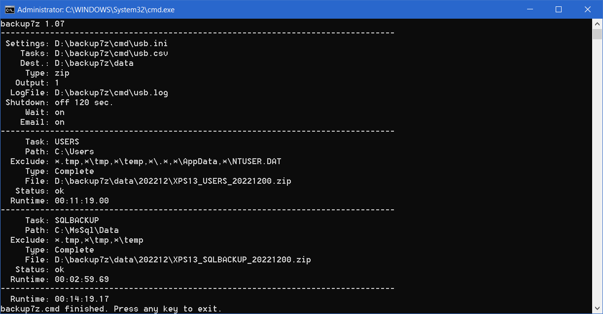

backup7z.cmd
==========

## Beschreibung
### Datensicherung mit 7-Zip.
<p>Die freie Software 7-Zip wird unter Windows häufig zum erstellen und bearbeiten verschiedenster Archivformate genutzt. Sie eignet sich jedoch auch zur Datensicherung und stellt überdies mit seiner grafischen Benutzeroberfläche eine einfache Wiederherstellung von gesicherten Dateien da. Werden die Sicherungen im ZIP-Format angelegt können diese im Gegensatz zum proprietären 7z-Format direkt in Windows bearbeitet werden. Zugegeben eine komplette Systemwiederherstellung wird man damit nicht erreichen, dies ist in der Regel mit erheblich mehr Zeit.- und Kostenaufwand realisierbar und ist selbst in einem professionalem Umfeld nicht immer die erste Wahl. Im privaten Bereich sollten sich Sicherungen auf erstellte Dateien wie Dokumente, Bilder, Videos und ähnliches begrenzen und vor allen Dingen zügig laufen, denn nur so werden diese auch regelmäßig durchgeführt.</p>

<p>Die Batchdatei backup7z.cmd automatisiert das Erstellen von Sicherungen. Sie erstellt eine monatliche Komplettsicherung, welche Basis für nachfolgende inkrementelle Sicherungen ist. Bei dieser Art der Sicherung wird nur die Teilgruppe von Dateien gesichert, die sich seit der vorherigen Sicherung verändert haben. Sie bezieht sich also immer auf die vorherige Sicherung, welche entweder eine Komplettsicherung oder eine inkrementelle Sicherung sein kann. Inkrementelles Sichern ist nicht nur leistungsfähiger und schneller, es benötigt zudem wesentlich weniger Speicherplatz.</p>

<p>In der Batchdatei backup7z.cmd bezieht sich die inkrementelle Sicherung immer auf die monatliche Komplettsicherung. Zunächst sind die zu sichernden Verzeichnisse in einer Aufgabendatei zu erfassen. Die Aufgabendatei besteht pro Zeile aus 3 -durch Semikolons getrennte- Spalten. Die erste Spalte enthält einen eindeutigen Namen, die zweite das zu sichernde Verzeichnis und die dritte ist optional und enthält durch Kommas getrennte Ausnahmen.</p>

```text
USERS;C:\Users;*\.*,*\AppData,*\NTUSER.DAT
SQLBACKUP;C:\MsSql\Data
```
<p>Auf diese Weise können Sie eine Sicherungsaufgabe pro Zeile mit entsprechenden Ausnahmen angeben. Alle weiteren Konfigurationen wie bspw. das Ausgabeverzeichnis und vieles mehr, werden in einer INI-Konfigurationsdatei definiert. In diesem Fall möchten wir neben den Benutzerverzeichnissen unter 'C:\Users' alle Dateien unter 'C:\MsSql\Data' auf ein USB-Laufwerk sichern. Die Namen beider Dateien können frei gewählt werden und heißen in diesem Beispiel 'usb.csv' für die Aufgabendatei und 'usb.ini' für die Konfigurationsdatei und liegen neben der Batchdatei im Verzeichnis D:\backup7z\cmd des USB-Laufwerks.</p>

```text
[Backup]
Tasks=D:\backup7z\cmd\usb.csv
Destination=D:\backup7z\data
Type=ZIP
Password=
Exclude=\*.tmp,\*\tmp,*\temp
Output=1

[System]
LogFile=D:\backup7z\cmd\usb.log
Shutdown=0
ShutdownTime=120
Wait=1

[SMTP]
Email=true
Host=smtp.gmail.com
Port=587
Username=name@gmail.com
Password=w3brb4!kxEx
Sender=smtp@mydomain.de
Recipient='admin@mydomain.com','h.scheller@mydomain.com'
```

<details><summary>INI Konfigurationsdatei</summary>

### Konfiguration der INI-Datei.
<p>INI-Dateien enthalten Schlüssel-Wert-Paare, die in Abschnitte unterteilt sind. Unsere INI-Datei ist in drei Abschnitte unterteilt und enthält alle notwendigen Einstellungen wie wo und in welchem Format gespeichert werden soll. INI-Dateien sind vorteilhaft, wenn unterschiedliche Konfigurationen erstellt werden sollen. Wenn Sie beispielsweise Backups über den Taskplaner durchführen und einem Benutzer auch ermöglichen möchten, diese manuell auszuführen, sind unterschiedliche Konfigurationen mit unterschiedlichen INI-Dateien recht einfach zu bewerkstelligen.</p>

**[Backup]**
<h5>
<table><tr>
<td>Tasks</td>
<td>Gibt den Namen der Aufgabendatei an.</td>
</tr><tr>
<td>Destination</td><td>Gibt das Sicherungsziel an. Meist eine externe Festplatte oder ein Netzlaufwerk, auf dem das Backup gespeichert werden soll. Wenn ein UNC-Pfad angegeben wird, sollte die Authentifizierung vorher in Windows gespeichert werden.</td>
</tr><tr>
<td>Type</td>
<td>Gibt den Typ des Sicherungsarchiv an. Mögliche Werte sind zip oder 7z. Der Typ zip ist Standard und wird auch direkt von Windows unterstützt.</td>
</tr><tr>
<td>Password</td>
<td>Durch Angabe eines Kennwortes wird das Sicherungsarchiv verschlüsselt.</td>
</tr><tr>
<td>Exclude</td>
<td>Generelle Ausschluss Maske für Dateien und Verzeichnise welche durch Kommas getrennt sein müssen. Ein Beispiel wäre: *\tmp,*.bak,*.tmp  Dieser Wert ergänzt den in der Aufgabendatei angegebenen Wert.</td>
</tr><tr>
<td>Output</td>
<td>Definiert das Ausgabeformat des Sicherungsarchives. Das Ausgabeformat besteht aus dem Aufgabenamen, Computernamen sowie dem Datum. Es sind 30 verschiedene Ausgabeformate welche nachfolgend beschrieben sind.</td>
</tr></table>
</h5>
<br/>

**[System]**
<h5><table><tr>
<td>LogFile</td>
<td>Datei, die die Sicherungen protokolliert. Standardwert ist der Computername im Ausführungsverzeichnis.</td>
</tr><tr>
<td>Shutdown</td>
<td>Schalter, fährt den Computer herunter, nachdem die Sicherung abgeschlossen ist. Gültige Werte sind 0/1 off/on true/false.</td>
</tr><tr>
<td>ShutdownTime</td>
<td>Legt die Abschaltzeit in Sekunden fest. Es können Werte zwischen 30 und 600 angegeben werden.</td>
</tr><tr>
<td>Wait</td>
<td>Schalter, wartet nach der Ausführung auf eine Tastatureingabe. Gültige Werte sind 0/1 off/on true/false.</td>
</tr></table></h5>
<br/>

**[SMTP]**
<h5><table><tr>
<td>Email</td>
<td>Schalter, sendet nach der Sicherung eine E-Mail über SMTP. Vorausgesetzt, nachfolgende Werte sind korrekt. Gültige Werte sind 0/1 off/on true/false.</td>
</tr><tr>
<td>Host</td>
<td>SMTP Host.</td>
</tr><tr>
<td>Port</td>
<td>SMTP Port meist 25 or 587</td>
</tr><tr>
<td>Username</td>
<td>Benutzername</td>
</tr><tr>
<td>Password</td>
<td>Kennwort</td>
</tr><tr>
<td>Sender</td>
<td>Name des Absenders.</td>
</tr><tr>
<td>Recipient</td>
<td>Achtung, im Gegensatz zum Absender müssen die Empfänger immer in Anführungszeichen gesetzt werden. Wenn Sie mehrere angeben möchten, müssen diese durch Kommas getrennt werden. z.B. 'admin@mydomain.com','h.scheller@mydomain.com'</td>
</tr></table></h5></p>
</details>
<br/>


### Ausgabe der Datensicherung.
<p>Im Abschnitt [Backup] der INI-Datei wird das Ausgabeverzeichnis sowie das Ausgabeformat anhand der Schlüssel Destination und Output festgelegt. Es gibt 30 verschiedene Ausgabeformate welche sich aus dem aktuellen Datum, dem Computernamen sowie dem in der Aufgabendatei festgeletem Namen der Sicherung. In der nachfolgenden Tabelle werden die Möglichkeiten der Einstellungen dargestellt.<p>

<details><summary>Output format</summary>
<p>
<br/>
<h5>
<table>
<tr><td>ID</td><td>Directory</td><td>File</td></tr>
<tr><td>1</td><td>BACKUP\JJJJMM</td><td>COMPUTERNAME_NAME_JJJJMMTT.zip</td></tr>
<tr><td>2</td><td>BACKUP\JJJJMM</td><td>COMPUTERNAME_JJJJMMTT_NAME.zip</td></tr>
<tr><td>3</td><td>BACKUP\JJJJMM</td><td>NAME_COMPUTERNAME_JJJJMMTT.zip</td></tr>
<tr><td>4</td><td>BACKUP\JJJJMM</td><td>NAME_JJJJMMTT_COMPUTERNAME.zip</td></tr>
<tr><td>5</td><td>BACKUP\JJJJMM</td><td>JJJJMMTT_COMPUTERNAME_NAME.zip</td></tr>
<tr><td>6</td><td>BACKUP\JJJJMM</td><td>JJJJMMTT_NAME_COMPUTERNAME.zip</td></tr>
<tr><td>7</td><td>BACKUP\JJJJMM_COMPUTERNAME</td><td>COMPUTERNAME_NAME_JJJJMMTT.zip</td></tr>
<tr><td>8</td><td>BACKUP\JJJJMM_COMPUTERNAME</td><td>COMPUTERNAME_JJJJMMTT_NAME.zip</td></tr>
<tr><td>9</td><td>BACKUP\JJJJMM_COMPUTERNAME</td><td>NAME_COMPUTERNAME_JJJJMMTT.zip</td></tr>
<tr><td>10</td><td>BACKUP\JJJJMM_COMPUTERNAME</td><td>NAME_JJJJMMTT_COMPUTERNAME.zip</td></tr>
<tr><td>11</td><td>BACKUP\JJJJMM_COMPUTERNAME</td><td>JJJJMMTT_COMPUTERNAME_NAME.zip</td></tr>
<tr><td>12</td><td>BACKUP\JJJJMM_COMPUTERNAME</td><td>JJJJMMTT_NAME_COMPUTERNAME.zip</td></tr>
<tr><td>13</td><td>BACKUP\COMPUTERNAME_JJJJMM</td><td>COMPUTERNAME_NAME_JJJJMMTT.zip</td></tr>
<tr><td>14</td><td>BACKUP\COMPUTERNAME_JJJJMM</td><td>COMPUTERNAME_JJJJMMTT_NAME.zip</td></tr>
<tr><td>15</td><td>BACKUP\COMPUTERNAME_JJJJMM</td><td>NAME_COMPUTERNAME_JJJJMMTT.zip</td></tr>
<tr><td>16</td><td>BACKUP\COMPUTERNAME_JJJJMM</td><td>NAME_JJJJMMTT_COMPUTERNAME.zip</td></tr>
<tr><td>17</td><td>BACKUP\COMPUTERNAME_JJJJMM</td><td>JJJJMMTT_COMPUTERNAME_NAME.zip</td></tr>
<tr><td>18</td><td>BACKUP\COMPUTERNAME_JJJJMM</td><td>JJJJMMTT_NAME_COMPUTERNAME.zip</td></tr>
<tr><td>19</td><td>BACKUP\JJJJMM\COMPUTERNAME</td><td>COMPUTERNAME_NAME_JJJJMMTT.zip</td></tr>
<tr><td>20</td><td>BACKUP\JJJJMM\COMPUTERNAME</td><td>COMPUTERNAME_JJJJMMTT_NAME.zip</td></tr>
<tr><td>21</td><td>BACKUP\JJJJMM\COMPUTERNAME</td><td>NAME_COMPUTERNAME_JJJJMMTT.zip</td></tr>
<tr><td>22</td><td>BACKUP\JJJJMM\COMPUTERNAME</td><td>NAME_JJJJMMTT_COMPUTERNAME.zip</td></tr>
<tr><td>23</td><td>BACKUP\JJJJMM\COMPUTERNAME</td><td>JJJJMMTT_COMPUTERNAME_NAME.zip</td></tr>
<tr><td>24</td><td>BACKUP\JJJJMM\COMPUTERNAME</td><td>JJJJMMTT_NAME_COMPUTERNAME.zip</td></tr>
<tr><td>25</td><td>BACKUP\COMPUTERNAME\JJJJMM</td><td>COMPUTERNAME_NAME_JJJJMMTT.zip</td></tr>
<tr><td>26</td><td>BACKUP\COMPUTERNAME\JJJJMM</td><td>COMPUTERNAME_JJJJMMTT_NAME.zip</td></tr>
<tr><td>27</td><td>BACKUP\COMPUTERNAME\JJJJMM</td><td>NAME_COMPUTERNAME_JJJJMMTT.zip</td></tr>
<tr><td>28</td><td>BACKUP\COMPUTERNAME\JJJJMM</td><td>NAME_JJJJMMTT_COMPUTERNAME.zip</td></tr>
<tr><td>29</td><td>BACKUP\COMPUTERNAME\JJJJMM</td><td>JJJJMMTT_COMPUTERNAME_NAME.zip</td></tr>
<tr><td>30</td><td>BACKUP\COMPUTERNAME\JJJJMM</td><td>JJJJMMTT_NAME_COMPUTERNAME.zip</td></tr>
</table>
</h5>
</p>
</details><br/>


<p>Ist alles wie in diesem Beispiel konfiguriert, wird die 'usb.ini' als Argument beim Aufruf wie folgt angegeben.</p><br/>
Beispiel:

```text
D:\backup7z\cmd\backup7z.cmd D:\backup7z\cmd\usb.ini
```

<br/>



<p>Gegebenfalls werden aufgrund fehlender Zugriffsrechte nur der eigene Teil des C:\Users Verzeichnisses gesichert. Was aus Datenschutzgründen durchaus Sinn macht. Einträge im Ereignisprotokoll sowie der Dateien im /log Verzeichnis helfen bei der Fehlersuche.</p>


## Requirements
* [7-Zip](https://www.7-zip.org/download.html)
* Microsoft Windows PowerShell
<hr/>

## License
MIT License

Copyright (c) 2022 H. Scheller

Permission is hereby granted, free of charge, to any person obtaining a copy
of this software and associated documentation files (the "Software"), to deal
in the Software without restriction, including without limitation the rights
to use, copy, modify, merge, publish, distribute, sublicense, and/or sell
copies of the Software, and to permit persons to whom the Software is
furnished to do so, subject to the following conditions:

The above copyright notice and this permission notice shall be included in all
copies or substantial portions of the Software.

THE SOFTWARE IS PROVIDED "AS IS", WITHOUT WARRANTY OF ANY KIND, EXPRESS OR
IMPLIED, INCLUDING BUT NOT LIMITED TO THE WARRANTIES OF MERCHANTABILITY,
FITNESS FOR A PARTICULAR PURPOSE AND NONINFRINGEMENT. IN NO EVENT SHALL THE
AUTHORS OR COPYRIGHT HOLDERS BE LIABLE FOR ANY CLAIM, DAMAGES OR OTHER
LIABILITY, WHETHER IN AN ACTION OF CONTRACT, TORT OR OTHERWISE, ARISING FROM,
OUT OF OR IN CONNECTION WITH THE SOFTWARE OR THE USE OR OTHER DEALINGS IN THE
SOFTWARE.

Note the licensing of the [7-Zip Software](https://www.7-zip.org/license.txt)