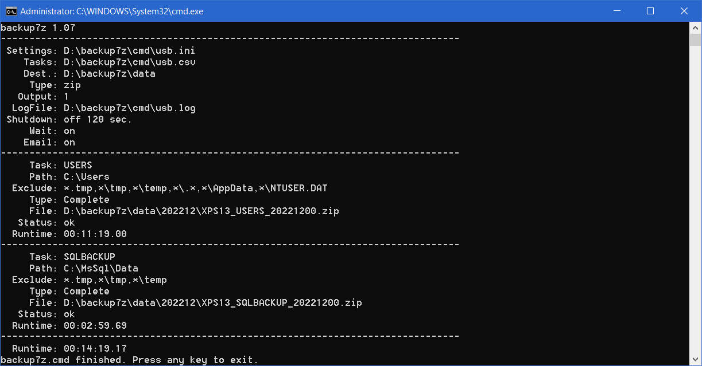

backup7z.cmd
==========

## Description
### Backup with 7-Zip.
<p>The free software 7-Zip is often used under Windows to create and edit a wide variety of archive formats. However, it is also suitable for data backup and, with its graphical user interface, also makes it easy to restore backed up files. If the backups are created in ZIP format, they can be edited directly in Windows, in contrast to the proprietary 7z format. Admittedly, you will not achieve a complete system recovery with this, this can usually be implemented with considerably more time and money and is not always the first choice, even in a professional environment. In the private sector, backups should be limited to created files such as documents, images, videos and the like and, above all, run quickly, because this is the only way they can be carried out regularly.</p>

<p>The backup7z.cmd batch file automates the creation of backups. It creates a monthly full backup, which is the basis for subsequent incremental backups. This type of backup backs up only the subset of files that have changed since the previous backup. It always refers to the previous backup, which can either be a full backup or an incremental backup. Incremental backup is not only more powerful and faster, it also requires significantly less storage space.</p>

<p>In the backup7z.cmd batch file, the incremental backup always refers to the monthly full backup. First, the directories to be backed up must be recorded in a task file. The task file consists of 3 columns per line, separated by semicolons. The first column contains a unique name, the second contains the directory to back up, and the third is optional and contains exceptions separated by commas.</p>

```text
USERS;C:\Users;*\.*,*\AppData,*\NTUSER.DAT
SQLBACKUP;C:\MsSql\Data
```
<p>This allows you to specify one backup task per line with appropriate exceptions. All other configurations such as the output directory and much more are defined in an INI configuration file. In this case, in addition to the user directories under 'C:\Users', we want to back up all files under 'C:\MsSql\Data' to a USB drive. The names of both files can be chosen freely and in this example are called 'usb.csv' for the task file and 'usb.ini' for the configuration file and are located next to the batch file in the directory D:\backup7z\cmd on the USB drive.</p>


```text
[Backup]
Tasks=D:\backup7z\cmd\usb.csv
Destination=D:\backup7z\data
Type=ZIP
Password=
Exclude=\*.tmp,\*\tmp,*\temp
Output=1

[System]
LogFile=D:\backup7z\cmd\usb.log
Shutdown=0
ShutdownTime=120
Wait=1

[SMTP]
Email=true
Host=smtp.gmail.com
Port=587
Username=name@gmail.com
Password=w3brb4!kxEx
Sender=smtp@mydomain.de
Recipient='admin@mydomain.com','h.scheller@mydomain.com'
```
<details><summary>INI configuration file</summary>

### Configuration of the INI file.
<p>INI files contain key-value pairs divided into sections. Our INI file is divided into three sections and contains all the necessary settings such as where and in what format to save. INI files are advantageous if different configurations are to be created. For example, if you want to run backups via Task Scheduler and also allow a user to run them manually, different configurations with different INI files are quite easy to do.</p>

**[backup]**
<h5>
<table><tr>
<td>Tasks</td>
<td>Specifies the name of the task file.</td>
</tr><tr>
<td>Destination</td><td>Specifies the backup destination. Usually an external hard drive or a network drive on which to save the backup. If a UNC path is given, the authentication should be saved in Windows beforehand.</td>
</tr><tr>
<td>Type</td>
<td>Specifies the type of backup archive. Possible values are zip or 7z. The zip type is standard and is also directly supported by Windows.</td>
</tr><tr>
<td>Password</td>
<td>The backup archive is encrypted by specifying a password.</td>
</tr><tr>
<td>Exclude</td>
<td>General exclusion mask for files and directories which must be separated by commas. An example would be: *\tmp,*.bak,*.tmp This value supplements the value specified in the task file.</td>
</tr><tr>
<td>Output</td>
<td>Defines the output format of the backup archive. The output format consists of the task name, computer name and the date. There are 30 different output formats which are described below.</td>
</tr></table>
</h5>
<br/>

**[System]**
<h5><table><tr>
<td>LogFile</td>
<td>File that logs the backups. Default is the computer name in the execution directory.</td>
</tr><tr>
<td>Shutdown</td>
<td>switch, shuts down the computer after the backup is complete. Valid values are 0/1 off/on true/false.</td>
</tr><tr>
<td>ShutdownTime</td>
<td>Specifies the shutdown time in seconds. Values between 30 and 600 can be specified.</td>
</tr><tr>
<td>Wait</td>
<td>switch, waits for keyboard input after execution. Valid values are 0/1 off/on true/false.</td>
</tr></table></h5>
<br/>

**[SMTP]**
<h5><table><tr>
<td>Email</td>
<td>switch, sends email via SMTP after backup. Assuming subsequent values are correct. Valid values are 0/1 off/on true/false.</td>
</tr><tr>
<td>Host</td>
<td>SMTP host.</td>
</tr><tr>
<td>Port</td>
<td>SMTP port mostly 25 or 587</td>
</tr><tr>
<td>Username</td>
<td>Username</td>
</tr><tr>
<td>Password</td>
<td>password</td>
</tr><tr>
<td>Sender</td>
<td>Sender's name.</td>
</tr><tr>
<td>Recipient</td>
<td>Attention, in contrast to the sender, the recipients must always be put in quotation marks. If you want to specify more than one, they must be separated by commas. e.g. 'admin@mydomain.com','h.scheller@mydomain.com'</td>
</tr></table></h5></p>
</details>
<br/>

### Backup output.
<p>In the [Backup] section of the INI file, the output directory and the output format are specified using the Destination and Output keys. There are 30 different output formats which are made up of the current date, the computer name and the name of the backup specified in the task file. The following table shows the options for the settings.<p>


<details><summary>Output format</summary>
<p>
<br/>
<h5>
<table>
<tr><td>ID</td><td>Directory</td><td>File</td></tr>
<tr><td>1</td><td>BACKUP\YYYYMM</td><td>COMPUTERNAME_NAME_YYYYMMDD.zip</td></tr>
<tr><td>2</td><td>BACKUP\YYYYMM</td><td>COMPUTERNAME_YYYYMMDD_NAME.zip</td></tr>
<tr><td>3</td><td>BACKUP\YYYYMM</td><td>NAME_COMPUTERNAME_YYYYMMDD.zip</td></tr>
<tr><td>4</td><td>BACKUP\YYYYMM</td><td>NAME_YYYYMMDD_COMPUTERNAME.zip</td></tr>
<tr><td>5</td><td>BACKUP\YYYYMM</td><td>YYYYMMDD_COMPUTERNAME_NAME.zip</td></tr>
<tr><td>6</td><td>BACKUP\YYYYMM</td><td>YYYYMMDD_NAME_COMPUTERNAME.zip</td></tr>
<tr><td>7</td><td>BACKUP\YYYYMM_COMPUTERNAME</td><td>COMPUTERNAME_NAME_YYYYMMDD.zip</td></tr>
<tr><td>8</td><td>BACKUP\YYYYMM_COMPUTERNAME</td><td>COMPUTERNAME_YYYYMMDD_NAME.zip</td></tr>
<tr><td>9</td><td>BACKUP\YYYYMM_COMPUTERNAME</td><td>NAME_COMPUTERNAME_YYYYMMDD.zip</td></tr>
<tr><td>10</td><td>BACKUP\YYYYMM_COMPUTERNAME</td><td>NAME_YYYYMMDD_COMPUTERNAME.zip</td></tr>
<tr><td>11</td><td>BACKUP\YYYYMM_COMPUTERNAME</td><td>YYYYMMDD_COMPUTERNAME_NAME.zip</td></tr>
<tr><td>12</td><td>BACKUP\YYYYMM_COMPUTERNAME</td><td>YYYYMMDD_NAME_COMPUTERNAME.zip</td></tr>
<tr><td>13</td><td>BACKUP\COMPUTERNAME_YYYYMM</td><td>COMPUTERNAME_NAME_YYYYMMDD.zip</td></tr>
<tr><td>14</td><td>BACKUP\COMPUTERNAME_YYYYMM</td><td>COMPUTERNAME_YYYYMMDD_NAME.zip</td></tr>
<tr><td>15</td><td>BACKUP\COMPUTERNAME_YYYYMM</td><td>NAME_COMPUTERNAME_YYYYMMDD.zip</td></tr>
<tr><td>16</td><td>BACKUP\COMPUTERNAME_YYYYMM</td><td>NAME_YYYYMMDD_COMPUTERNAME.zip</td></tr>
<tr><td>17</td><td>BACKUP\COMPUTERNAME_YYYYMM</td><td>YYYYMMDD_COMPUTERNAME_NAME.zip</td></tr>
<tr><td>18</td><td>BACKUP\COMPUTERNAME_YYYYMM</td><td>YYYYMMDD_NAME_COMPUTERNAME.zip</td></tr>
<tr><td>19</td><td>BACKUP\YYYYMM\COMPUTERNAME</td><td>COMPUTERNAME_NAME_YYYYMMDD.zip</td></tr>
<tr><td>20</td><td>BACKUP\YYYYMM\COMPUTERNAME</td><td>COMPUTERNAME_YYYYMMDD_NAME.zip</td></tr>
<tr><td>21</td><td>BACKUP\YYYYMM\COMPUTERNAME</td><td>NAME_COMPUTERNAME_YYYYMMDD.zip</td></tr>
<tr><td>22</td><td>BACKUP\YYYYMM\COMPUTERNAME</td><td>NAME_YYYYMMDD_COMPUTERNAME.zip</td></tr>
<tr><td>23</td><td>BACKUP\YYYYMM\COMPUTERNAME</td><td>YYYYMMDD_COMPUTERNAME_NAME.zip</td></tr>
<tr><td>24</td><td>BACKUP\YYYYMM\COMPUTERNAME</td><td>YYYYMMDD_NAME_COMPUTERNAME.zip</td></tr>
<tr><td>25</td><td>BACKUP\COMPUTERNAME\YYYYMM</td><td>COMPUTERNAME_NAME_YYYYMMDD.zip</td></tr>
<tr><td>26</td><td>BACKUP\COMPUTERNAME\YYYYMM</td><td>COMPUTERNAME_YYYYMMDD_NAME.zip</td></tr>
<tr><td>27</td><td>BACKUP\COMPUTERNAME\YYYYMM</td><td>NAME_COMPUTERNAME_YYYYMMDD.zip</td></tr>
<tr><td>28</td><td>BACKUP\COMPUTERNAME\YYYYMM</td><td>NAME_YYYYMMDD_COMPUTERNAME.zip</td></tr>
<tr><td>29</td><td>BACKUP\COMPUTERNAME\YYYYMM</td><td>YYYYMMDD_COMPUTERNAME_NAME.zip</td></tr>
<tr><td>30</td><td>BACKUP\COMPUTERNAME\YYYYMM</td><td>YYYYMMDD_NAME_COMPUTERNAME.zip</td></tr>
</table>
</h5>
</p>
</details><br/>

<p>If everything is configured as in this example, the 'usb.ini' is specified as an argument when called as follows.</p><br/>
Example:

```text
D:\backup7z\cmd\backup7z.cmd D:\backup7z\cmd\usb.ini
```

<br/>



<p>If necessary, only the own part of the C:\Users directory is backed up due to missing access rights. Which makes perfect sense for privacy reasons. Entries in the event log and the files in the /log directory help with troubleshooting.</p>


## Requirements
* [7-Zip](https://www.7-zip.org/download.html)
* Microsoft Windows PowerShell
<hr/>

## License
MIT License

Copyright (c) 2022 H. Scheller

Permission is hereby granted, free of charge, to any person obtaining a copy
of this software and associated documentation files (the "Software"), to deal
in the Software without restriction, including without limitation the rights
to use, copy, modify, merge, publish, distribute, sublicense, and/or sell
copies of the Software, and to permit persons to whom the Software is
furnished to do so, subject to the following conditions:

The above copyright notice and this permission notice shall be included in all
copies or substantial portions of the Software.

THE SOFTWARE IS PROVIDED "AS IS", WITHOUT WARRANTY OF ANY KIND, EXPRESS OR
IMPLIED, INCLUDING BUT NOT LIMITED TO THE WARRANTIES OF MERCHANTABILITY,
FITNESS FOR A PARTICULAR PURPOSE AND NONINFRINGEMENT. IN NO EVENT SHALL THE
AUTHORS OR COPYRIGHT HOLDERS BE LIABLE FOR ANY CLAIM, DAMAGES OR OTHER
LIABILITY, WHETHER IN AN ACTION OF CONTRACT, TORT OR OTHERWISE, ARISING FROM,
OUT OF OR IN CONNECTION WITH THE SOFTWARE OR THE USE OR OTHER DEALINGS IN THE
SOFTWARE.

Note the licensing of the [7-Zip Software](https://www.7-zip.org/license.txt)